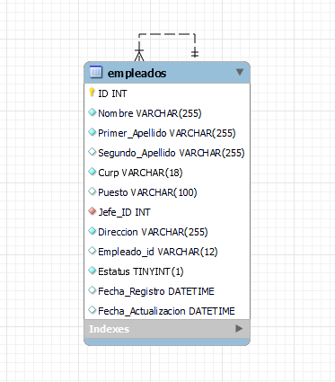

# Proyecto de Gestión de Empleados
---
Este proyecto utiliza **FastAPI** y **MySQL** para gestionar empleados en una organización. A continuación se detallan los pasos para instalar las dependencias necesarias.

---

## 🔗 Links
### Tecnologías necesarias

[](https://www.python.org/downloads/)
[](https://www.mysql.com/)
[](https://fastapi.tiangolo.com/)
[](https://www.uvicorn.org/)

---

## Requisitos Previos

Antes de comenzar, asegúrate de tener instalado lo siguiente:

- [Python](https://www.python.org/downloads/)
- [MySQL](https://www.mysql.com/)
- [pip](https://pip.pypa.io/en/stable/) 

---
## Comandos necesarios

1. **Instalación de Dependencias**

```bash
  pip install -r requirements.txt
```
    
2. **Creacion y activacion del entorno**
```bash
    python -m venv env
    cd rutaDeClonacion\env\Scripts\activate
```
3. **Base de Datos en MySQL**
```bash
    create database CasoPractico;
    use CasoPractico;
```
  3.1 **Diagrama E-R**
  
  
4. **Correr el proyecto**
```bash
    uvicorn app:app ó uvicorn app:app --reload
```
5. **Entar a las rutas del servidor**
    - Seleccionar la ruta que da el servidor en consola.
    - Agregar a la ruta anterior: "ruta/docs" (http://127.0.0.1:8000/docs)
    en ella se podran visualizar las rutas de una manera mas intuitiva


